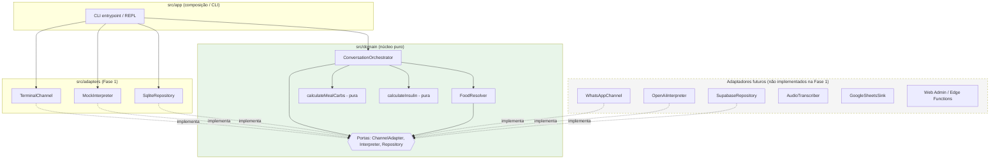
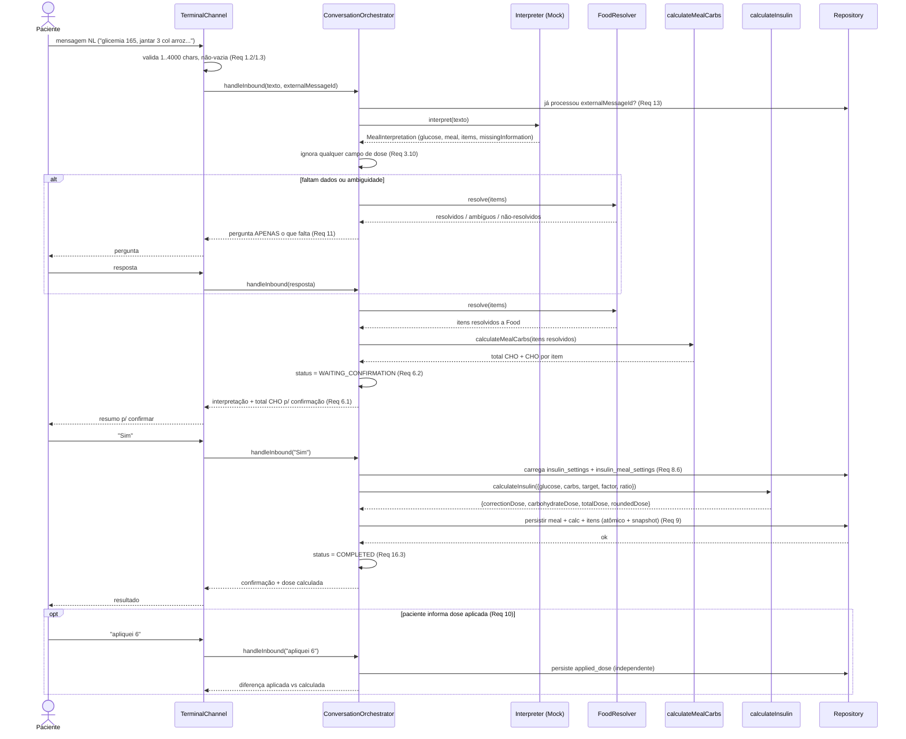
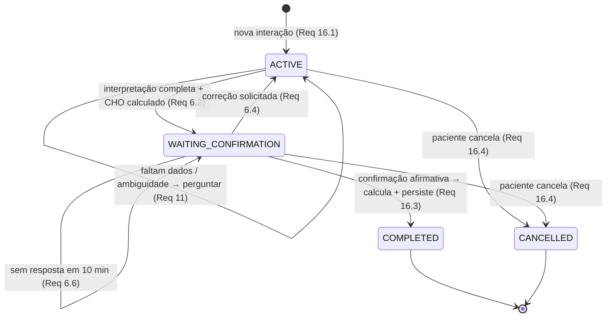
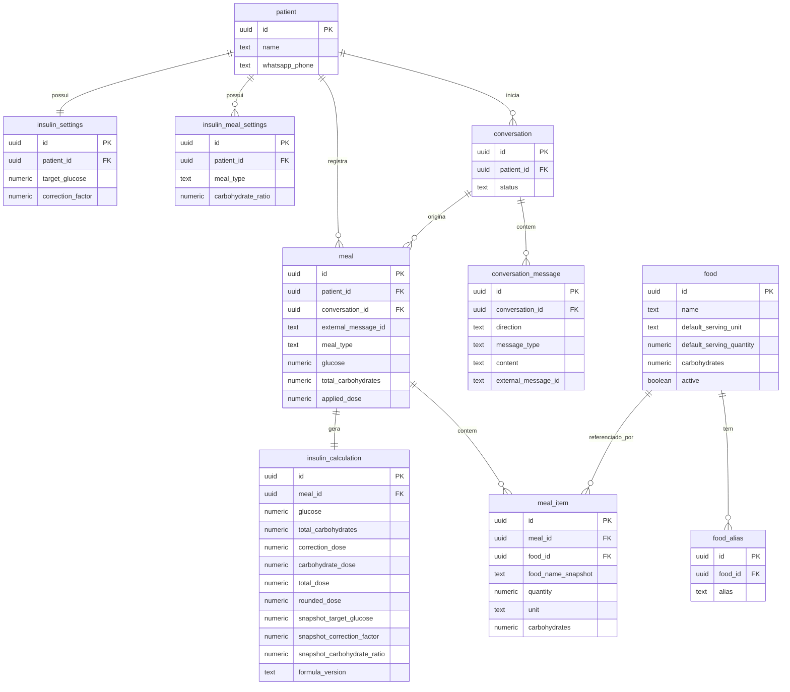

# Documento de Design — Glicia

## Overview

Glicia é um assistente pessoal para registro e acompanhamento do controle glicêmico de UMA ÚNICA pessoa com diabetes tipo 1. Este documento descreve o design técnico derivado dos 20 requisitos definidos em `requirements.md`.

O escopo **primário** deste design é a **Fase 1 (MVP Local)**: um aplicativo executável via **terminal (CLI/REPL)**, totalmente **offline**, sem qualquer chamada de rede (sem Supabase, OpenAI, WhatsApp ou Google Sheets). O objetivo é validar a solução e a qualidade do código localmente antes de qualquer deploy.

As Fases 2 e 3 (WhatsApp Cloud API, OpenAI Responses API, Supabase Auth/RLS/Edge Functions, áudio, Google Sheets, web admin) são tratadas como **extensões futuras**. O design expõe os **pontos de extensão** (portas/adaptadores) sem implementá-los na Fase 1, e sem que a Fase 1 os bloqueie.

### Princípio arquitetural central

> **"IA interpreta. Banco fornece dados. Código calcula. Usuária confirma."**

Consequências concretas para o design:

- O **Interpreter** apenas extrai dados explicitamente presentes na mensagem (`MealInterpretation`). Ele NUNCA calcula, recomenda ou decide dose.
- O contrato `MealInterpretation` **não possui** campo de dose. Se algum interpretador (fase futura) retornar dose, o domínio **ignora** o campo (Req 3.9, 3.10).
- Os valores nutricionais vêm **exclusivamente** do `Food_Database` (Req 4.9, 4.10).
- O cálculo de insulina é uma **função pura e determinística**, em **um único lugar** do código, sem dependência de rede/IO/env (Req 7.7, 7.8).
- Nada é persistido sem **confirmação explícita** da usuária (Req 6).

### Mapeamento Requisitos × Fase

| Requisito | Tema | Fase 1 (MVP Local) | Ponto de extensão futuro |
|---|---|---|---|
| R1 | Entrada via Terminal | `Terminal_Channel` (CLI/REPL) | — |
| R2 | Abstração de canal/interpretador | Portas `ChannelAdapter` e `Interpreter` | WhatsApp channel, OpenAI interpreter |
| R3 | Interpretação NL | `MockInterpreter` determinístico | `OpenAiInterpreter` (Responses API + JSON Schema) |
| R4 | Resolução de alimentos | `FoodResolver` + repositório local | mesmo resolver sobre Supabase |
| R5 | Cálculo de CHO | função pura `calculateMealCarbs` | — |
| R6 | Confirmação explícita | máquina de estados no orquestrador | — |
| R7 | Motor de cálculo de insulina | função pura `calculateInsulin` | — (inalterado) |
| R8 | Parâmetros configuráveis | tabelas `insulin_settings`, `insulin_meal_settings` | web admin edita parâmetros |
| R9 | Persistência + snapshot | transação local atômica | transação Supabase |
| R10 | Dose calculada vs aplicada | campos separados | — |
| R11 | Perguntas por info ausente | orquestrador | — |
| R12 | Importação SBD | seed determinístico (CSV/JSON → DB) | — |
| R13 | Idempotência/dedupe | unicidade de `external_message_id` | ID de mensagem do WhatsApp |
| R14 | Autorização paciente única | identidade fixa no terminal | validação por `whatsapp_phone` |
| R15 | Segurança/privacidade | `.env.example`, logs sem dados clínicos | segredos server-side, RLS/Auth |
| R16 | Gestão de conversa | `conversation` + `conversation_message` | `message_type=AUDIO` |
| R17 | Limites clínicos | apenas protocolo configurado | — |
| R18 | Testabilidade | unit + PBT + e2e offline | — |
| R19 | Fluxo principal e2e | executável via terminal | mesmo pipeline no WhatsApp |
| R20 | Extensibilidade | portas prontas | WhatsApp, OpenAI, áudio, Sheets, web |

### Aviso clínico

A fórmula reflete o protocolo atualmente configurado na planilha da usuária e **não** é recomendação médica universal. O sistema executa deterministicamente apenas o protocolo configurado (Formula_Version "1.0") e não introduz regras clínicas não especificadas (Req 17).

---

## Architecture

A arquitetura é uma **hexagonal enxuta** (ports & adapters), sem over-engineering. Há um **núcleo de domínio puro** cercado por **portas** (interfaces). Adaptadores concretos plugam nas portas. Trocar terminal→WhatsApp ou mock→OpenAI significa trocar um adaptador, sem tocar no domínio (Req 2, Req 20).

Regra de dependência: **adaptadores dependem do domínio; o domínio não conhece nenhum adaptador.**

### Camadas

- **Domínio puro** (`src/domain`): tipos de domínio, `calculateInsulin` (função pura), `calculateMealCarbs` (função pura), `FoodResolver` (lógica de correspondência), `ConversationOrchestrator` (máquina de estados + fluxo), e a definição das **portas**.
- **Portas** (interfaces definidas no domínio): `ChannelAdapter`, `Interpreter`, `Repository` (persistência), e a fonte de leitura de alimentos usada pelo `FoodResolver`.
- **Adaptadores Fase 1** (`src/adapters`): `TerminalChannel`, `MockInterpreter`, persistência local (`SqliteRepository`).
- **Aplicação** (`src/app`): composição (wiring) e entrypoint da CLI.

### Diagrama de componentes



### Diagrama de sequência — fluxo principal end-to-end (Req 19)



### Diagrama de estados da Conversation (Req 16)



---

## Components and Interfaces

Todas as assinaturas abaixo são TypeScript (pseudocódigo de contrato). O domínio é agnóstico de canal e de IO.

### Tipos de domínio

```ts
// src/domain/types.ts

export type MealType = "BREAKFAST" | "LUNCH" | "SNACK" | "DINNER";

export type MissingInfo = "GLUCOSE" | "MEAL" | "FOOD_QUANTITY" | "FOOD";

export type ConversationStatus =
  | "ACTIVE"
  | "WAITING_CONFIRMATION"
  | "COMPLETED"
  | "CANCELLED";

// Item cru extraído pelo interpretador (SEM dados nutricionais)
export interface InterpretedItem {
  foodName: string;          // não vazio (Req 3.5)
  quantity: number | null;   // > 0 ou null (Req 3.5)
  unit: string | null;       // texto ou null (Req 3.5)
}

// Contrato produzido pelo Interpreter — NUNCA contém dose (Req 3.1, 3.9)
export interface MealInterpretation {
  glucose: number | null;             // > 0 ou null (Req 3.3)
  meal: MealType | null;              // (Req 3.4)
  items: InterpretedItem[];           // no máx. 50 (Req 3.5)
  missingInformation: MissingInfo[];  // (Req 3.6)
}
```

### Porta: ChannelAdapter (Req 1.6, 2.2, 2.3)

Contrato único, apenas texto. Terminal e (futuro) WhatsApp são implementações intercambiáveis.

```ts
// src/domain/ports/channel-adapter.ts

export interface InboundMessage {
  externalMessageId: string; // dedupe/idempotência (Req 13)
  text: string;
}

export interface ChannelAdapter {
  // Registra o handler de domínio que recebe texto e devolve texto.
  onMessage(handler: (msg: InboundMessage) => Promise<void>): void;
  // Envia conteúdo textual de volta ao usuário (Req 1.5).
  send(text: string): Promise<void>;
  start(): Promise<void>;
  stop(): Promise<void>;
}
```

### Porta: Interpreter (Req 2.5, 3)

```ts
// src/domain/ports/interpreter.ts

export interface Interpreter {
  // Converte texto em MealInterpretation. Sem chamadas de rede no Mock (Req 3.11).
  interpret(text: string): Promise<MealInterpretation>;
}
```

O domínio **descarta** qualquer propriedade fora do contrato (ex.: dose) antes de usar o resultado (Req 3.10):

```ts
// Normaliza para o contrato canônico, ignorando campos extras (dose etc.)
function sanitizeInterpretation(raw: unknown): MealInterpretation;
```

### Porta: Repository (persistência) (Req 8, 9, 10, 13, 16)

Um único repositório coeso (sem repositórios genéricos nem factories desnecessárias — Req 20.6). A Fase 1 usa `SqliteRepository`; a fase futura, `SupabaseRepository`. Ambos implementam a mesma interface.

```ts
// src/domain/ports/repository.ts

export interface InsulinParameters {
  targetGlucose: number;      // insulin_settings
  correctionFactor: number;   // insulin_settings
  carbohydrateRatio: number;  // insulin_meal_settings pelo MealType
}

export interface Repository {
  // Paciente única (Req 14)
  getPatient(): Promise<Patient>;

  // Parâmetros de cálculo — leitura exclusiva daqui (Req 8.6)
  getInsulinParameters(mealType: MealType): Promise<InsulinParameters | null>;
  updateInsulinSetting(field: "target_glucose" | "correction_factor", value: number): Promise<void>;
  updateCarbohydrateRatio(mealType: MealType, value: number): Promise<void>;

  // Alimentos (usado pelo FoodResolver)
  findFoodByAliasExact(normalizedName: string): Promise<Food | null>;
  findFoodByNameExact(normalizedName: string): Promise<Food | null>;
  findFoodCandidates(normalizedName: string): Promise<Food[]>;

  // Idempotência (Req 13)
  isMessageProcessed(externalMessageId: string): Promise<boolean>;

  // Conversa (Req 16)
  createConversation(): Promise<Conversation>;
  updateConversationStatus(id: string, status: ConversationStatus): Promise<void>;
  appendConversationMessage(msg: NewConversationMessage): Promise<void>;

  // Persistência atômica de refeição + cálculo + itens (Req 9.3, 9.4)
  saveMealWithCalculation(input: SaveMealInput): Promise<{ mealId: string }>;

  // Dose aplicada, independente da calculada (Req 10)
  saveAppliedDose(mealId: string, appliedDose: number): Promise<void>;
}
```

### Low-Level Design do Domínio

#### calculateInsulin — função pura e determinística (Req 7)

```ts
// src/domain/insulin/calculate-insulin.ts

export const FORMULA_VERSION = "1.0";

export interface InsulinInput {
  glucose: number;
  carbohydrates: number;
  targetGlucose: number;
  correctionFactor: number;
  carbohydrateRatio: number;
}

export interface InsulinResult {
  correctionDose: number;    // (glucose - targetGlucose) / correctionFactor
  carbohydrateDose: number;  // carbohydrates / carbohydrateRatio
  totalDose: number;         // bruto (Req 7.5)
  roundedDose: number;       // inteiro; empate 0,5 → maior magnitude (Req 7.4)
}

// Erro de domínio (sem exceções de IO)
export class InsulinCalculationError extends Error {
  constructor(public code:
    | "MISSING_OR_INVALID_INPUT"   // Req 7.13
    | "ZERO_DIVISOR",              // Req 7.12
    message: string) { super(message); }
}

export function calculateInsulin(input: InsulinInput): InsulinResult {
  // 1) Validação: todos os números obrigatórios finitos (Req 7.13)
  //    Rejeita null/undefined/NaN/Infinity/-Infinity/não-número.
  // 2) Divisores: correctionFactor === 0 || carbohydrateRatio === 0 → ZERO_DIVISOR (Req 7.12)
  // 3) correctionDose = (glucose - targetGlucose) / correctionFactor  (Req 7.1, 7.9, 7.10)
  // 4) carbohydrateDose = carbohydrates / carbohydrateRatio           (Req 7.2, 7.11)
  // 5) totalDose = correctionDose + carbohydrateDose                  (Req 7.3)
  // 6) roundedDose = roundHalfAwayFromZero(totalDose)                 (Req 7.4)
  // Sem IO, sem env, sem rede (Req 7.7). Mesma entrada → mesma saída (Req 7.6).
}

// Arredondamento "meio para longe do zero" (maior magnitude no empate 0,5)
// Ex.: 2,5 → 3 ; -2,5 → -3 ; 2,4 → 2 ; 2,6 → 3
export function roundHalfAwayFromZero(x: number): number {
  return Math.sign(x) * Math.round(Math.abs(x));
}
```

Notas de decisão:
- `roundHalfAwayFromZero` implementa "empate 0,5 arredonda para o inteiro de maior magnitude" (Req 7.4). `Math.round(2.5)=3` mas `Math.round(-2.5)=-2`; por isso o cálculo separado por magnitude.
- O erro é sinalizado por **exceção de domínio tipada** (`InsulinCalculationError`), não por valor de dose (Req 7.12, 7.13). O chamador trata e informa a paciente.

#### calculateMealCarbs — cálculo determinístico de carboidratos (Req 5)

```ts
// src/domain/meals/calculate-meal-carbs.ts

export interface ResolvedItem {
  foodName: string;
  quantity: number;              // já validada (> 0, numérica)
  unit: string | null;
  carbsPerServing: number;       // carboidrato por medida, vindo do Food (Req 4.9)
  servingQuantity: number;       // default_serving_quantity do Food
  foodId: string;
}

export interface UnresolvedItem {
  foodName: string;
  reason: "NO_FOOD_MATCH" | "INVALID_QUANTITY"; // Req 5.5, 5.6
}

export interface MealCarbsResult {
  perItem: { foodId: string; foodName: string; carbohydrates: number }[]; // 2 casas (Req 5.4)
  totalCarbohydrates: number;   // soma, 2 casas decimais (Req 5.2)
  unresolved: UnresolvedItem[]; // preserva os já resolvidos (Req 5.5)
}

// Determinístico: entradas idênticas → mesmo total (Req 5.3).
// carbItem = round2(quantity * (carbsPerServing / servingQuantity))
// Itens inválidos são excluídos do total, sem interromper os demais (Req 5.5, 5.6).
export function calculateMealCarbs(items: ResolvedItem[]): MealCarbsResult;

export function round2(x: number): number; // arredonda p/ 2 casas em gramas
```

#### FoodResolver — cadeia de precedência (Req 4)

```ts
// src/domain/foods/food-resolver.ts

export type ResolutionOutcome =
  | { kind: "RESOLVED"; item: ResolvedItem }
  | { kind: "AMBIGUOUS"; foodName: string; candidates: Food[] } // Req 4.6
  | { kind: "UNRESOLVED"; foodName: string };                   // Req 4.8

export function normalizeName(raw: string): string {
  // Insensível a caixa e a espaços nas extremidades (Req 4.2)
  return raw.trim().toLowerCase();
}

export class FoodResolver {
  constructor(private repo: Pick<Repository,
    "findFoodByAliasExact" | "findFoodByNameExact" | "findFoodCandidates">) {}

  async resolveItem(item: InterpretedItem): Promise<ResolutionOutcome> {
    const key = normalizeName(item.foodName);
    // Cadeia de precedência, parando no primeiro nível que casar (Req 4.1):
    // 1) alias exato        → findFoodByAliasExact (Req 4.3)
    // 2) nome exato         → findFoodByNameExact  (Req 4.4)
    // 3) exatamente 1 candidato conhecido → findFoodCandidates (Req 4.5)
    //    - 0 candidatos  → UNRESOLVED (Req 4.8)
    //    - 1 candidato   → RESOLVED
    //    - >1 candidatos → AMBIGUOUS (Req 4.6)
  }

  async resolveAll(items: InterpretedItem[]): Promise<ResolutionOutcome[]>;
}
```

#### ConversationOrchestrator — máquina de estados + fluxo (Req 6, 11, 16, 19)

```ts
// src/domain/conversation/orchestrator.ts

export class ConversationOrchestrator {
  constructor(
    private interpreter: Interpreter,
    private resolver: FoodResolver,
    private repo: Repository,
    private channel: ChannelAdapter,
    private clock: () => Date,             // injetável p/ testes (timeout 10 min)
  ) {}

  // Ponto de entrada para toda mensagem inbound.
  async handleInbound(msg: InboundMessage): Promise<void> {
    // 0) Idempotência: se externalMessageId já processado → não cria refeição (Req 13.2)
    // 1) Autorização: paciente única no terminal (Req 14.3)
    // 2) Roteia conforme o status atual da conversa:
    //    ACTIVE → interpretar + resolver + calcular CHO
    //    WAITING_CONFIRMATION → tratar confirmação/correção/ambiguidade/seleção
  }

  // --- Sub-passos (privados) ---

  // Interpreta, sanitiza (remove dose), resolve alimentos, decide perguntas.
  private async interpretAndResolve(text: string): Promise<void>;

  // Decide, a partir de missingInformation e das resoluções, qual pergunta fazer.
  // Pergunta APENAS o que falta (Req 11.5, 11.6):
  //   GLUCOSE → pede glicemia (Req 11.1)
  //   MEAL → pede tipo de refeição (Req 11.2)
  //   FOOD → pede alimento não identificado (Req 11.3)
  //   FOOD_QUANTITY → pede quantidade (Req 11.4)
  //   AMBIGUOUS → apresenta candidatos e pede escolher exatamente um (Req 4.6)
  private nextPrompt(state: PendingMealState): string | null;

  // Apresenta interpretação + total CHO e passa a WAITING_CONFIRMATION (Req 6.1, 6.2).
  private async presentForConfirmation(state: PendingMealState): Promise<void>;

  // Interpreta a resposta de confirmação:
  //   afirmativa explícita ("sim") → calcula + persiste (Req 6.3)
  //   correção/rejeição → volta a ACTIVE e pede o dado a ajustar (Req 6.4)
  //   ambígua/não reconhecida → reapresenta e re-solicita (Req 6.7)
  private async handleConfirmationReply(text: string, state: PendingMealState): Promise<void>;

  // Executa calculateInsulin e persiste atômico com snapshot + formula_version (Req 9, 19.4).
  private async calculateAndPersist(state: PendingMealState): Promise<void>;

  // Registra dose aplicada (independente) e mostra diferença (Req 10).
  private async handleAppliedDose(text: string, mealId: string): Promise<void>;
}
```

O estado pendente de uma conversa (`PendingMealState`) mantém: `conversationId`, `status`, `glucose`, `meal`, itens resolvidos, itens ambíguos/não resolvidos, `totalCarbohydrates`, `waitingSince` (para o timeout de 10 min do Req 6.6). Na Fase 1 pode residir em memória ligado à `conversation` persistida; o `conversation.status` sempre reflete o estado canônico (Req 16).

### Adaptadores da Fase 1

#### TerminalChannel (Req 1)

```ts
// src/adapters/terminal/terminal-channel.ts
export class TerminalChannel implements ChannelAdapter {
  // Usa readline (REPL). Para cada linha:
  //  - rejeita vazia/só espaços (Req 1.2) e > 4000 chars (Req 1.3), exibindo erro e aguardando nova entrada
  //  - gera externalMessageId determinístico (ex.: hash do conteúdo + contador de sessão) p/ dedupe (Req 13.3)
  //  - encaminha texto íntegro ao handler (Req 1.4)
  //  - send() imprime a resposta íntegra (Req 1.5)
}
```

#### MockInterpreter (Req 3.11)

Determinístico e configurável, sem rede. Duas formas de uso combináveis:
- **Regras/parsing leve** para as frases de teste do fluxo e2e (extrai glicemia por número + unidade, tipo de refeição por palavras-chave, itens por separadores).
- **Roteiro pré-programado** (mapa `texto → MealInterpretation`) para cenários de teste específicos (completo, incompleto, ambíguo).

```ts
// src/adapters/interpreter-mock/mock-interpreter.ts
export class MockInterpreter implements Interpreter {
  constructor(private scripted?: Map<string, MealInterpretation>) {}
  async interpret(text: string): Promise<MealInterpretation> { /* determinístico */ }
}
```

#### SqliteRepository (persistência local)

Escolha justificada abaixo (ver Data Models). Implementa `Repository` com transações atômicas nativas do SQLite (`BEGIN/COMMIT/ROLLBACK`) para satisfazer Req 9.3/9.4.

### Adaptadores futuros (apenas descritos — não implementados na Fase 1)

- **WhatsAppChannel** (Req 20.1): implementa `ChannelAdapter`; recebe webhook do WhatsApp Cloud API, usa o `messageId` do WhatsApp como `externalMessageId` (Req 13.4) e valida `whatsapp_phone` do remetente (Req 14.4). Reaproveita 100% do pipeline de domínio.
- **OpenAiInterpreter** (Req 20.2): implementa `Interpreter` chamando a OpenAI **Responses API** com **JSON Schema** que reproduz `MealInterpretation` **sem** campo de dose. O domínio permanece idêntico.
- **AudioTranscriber** (Req 20.3): transcreve áudio do WhatsApp e injeta o texto no mesmo pipeline; `conversation_message.message_type` já suporta `AUDIO` (Req 16.6).
- **SupabaseRepository**: mesma interface `Repository` sobre Postgres/Supabase, com Auth + RLS (Req 15). Migrations compartilhadas com a Fase 1.
- **GoogleSheetsSink** (Req 20.4): Postgres é fonte de verdade; falha de sync com Sheets não afeta a refeição persistida.
- **Web Admin / Edge Functions** (Req 20.5): dashboard, gestão de alimentos, configurações e histórico; webhook em `supabase/functions/whatsapp-webhook`.

---

## Data Models

### Decisão de persistência (Fase 1) e caminho de migração

**Decisão:** usar **SQLite** na Fase 1 (arquivo local `glicia.db`, ou `:memory:` nos testes), com o **mesmo esquema relacional** que será usado no Postgres/Supabase.

Justificativa (simplicidade + baixa divergência):
- SQLite dá **transações atômicas reais** (BEGIN/COMMIT/ROLLBACK), necessárias para Req 9.3/9.4, sem subir serviço nenhum — 100% offline (Req 1.7, 18.6).
- O modelo relacional é **idêntico ao Postgres**, então a migração para Supabase é trocar o driver e ajustar dialeto nas migrations (UUID, timestamps), não redesenhar o schema.
- Alternativa "repositório em memória" seria ainda mais simples, mas divergiria do schema final e não exercitaria atomicidade/constraints. Por isso o `SqliteRepository` é o padrão; um `InMemoryRepository` fica disponível como fixture de teste opcional.

As **migrations** são escritas em SQL compatível com Postgres/Supabase e mantidas em `migrations/`. Na Fase 1 são aplicadas ao SQLite com pequenas adaptações de dialeto (documentadas por comentário). O objetivo é **um único schema versionado** servindo às duas fases.

Ponto crítico de modelagem (Req 9.8, 9.9): o **CHO é armazenado no `meal_item`** (junto de `food_name_snapshot`, `quantity`, `unit`). Refeições históricas são exibidas a partir do `meal_item`, **nunca** recalculadas a partir do valor atual do `food`.

### Diagrama entidade-relacionamento



### Migrations SQL (Postgres/Supabase — fonte única de schema)

```sql
-- migrations/0001_init.sql
-- Compatível com Postgres/Supabase. Na Fase 1 (SQLite) adaptar:
--   uuid            -> TEXT (uuid gerado na aplicação)
--   timestamptz     -> TEXT (ISO-8601) ou INTEGER (epoch)
--   numeric         -> REAL/NUMERIC
--   gen_random_uuid -> uuid gerado na aplicação
--   CHECK/UNIQUE/FK  são suportados por ambos.

-- Paciente única (Req 14.1, 14.5) — sem multi-tenancy (Req 20.6)
CREATE TABLE patient (
    id             uuid PRIMARY KEY DEFAULT gen_random_uuid(),
    name           text NOT NULL,
    whatsapp_phone text,                       -- usado só na fase futura (Req 14.4)
    created_at     timestamptz NOT NULL DEFAULT now()
);

-- Parâmetros globais de cálculo (Req 8.1)
CREATE TABLE insulin_settings (
    id               uuid PRIMARY KEY DEFAULT gen_random_uuid(),
    patient_id       uuid NOT NULL REFERENCES patient(id) ON DELETE CASCADE,
    target_glucose   numeric NOT NULL CHECK (target_glucose   > 0 AND target_glucose   <= 999),
    correction_factor numeric NOT NULL CHECK (correction_factor > 0 AND correction_factor <= 999),
    updated_at       timestamptz NOT NULL DEFAULT now(),
    UNIQUE (patient_id)
);

-- Relação insulina/carboidrato por tipo de refeição (Req 8.2)
CREATE TABLE insulin_meal_settings (
    id                 uuid PRIMARY KEY DEFAULT gen_random_uuid(),
    patient_id         uuid NOT NULL REFERENCES patient(id) ON DELETE CASCADE,
    meal_type          text NOT NULL CHECK (meal_type IN ('BREAKFAST','LUNCH','SNACK','DINNER')),
    carbohydrate_ratio numeric NOT NULL CHECK (carbohydrate_ratio > 0 AND carbohydrate_ratio <= 999),
    updated_at         timestamptz NOT NULL DEFAULT now(),
    UNIQUE (patient_id, meal_type)
);

-- Base de alimentos (Req 12)
CREATE TABLE food (
    id                       uuid PRIMARY KEY DEFAULT gen_random_uuid(),
    name                     text NOT NULL,
    default_serving_unit     text NOT NULL,      -- medida usual (Req 12.2)
    default_serving_quantity numeric NOT NULL,   -- em g/ml (Req 12.2)
    carbohydrates            numeric NOT NULL,   -- em g por medida (Req 12.2)
    active                   boolean NOT NULL DEFAULT true, -- (Req 12.3)
    created_at               timestamptz NOT NULL DEFAULT now()
);
-- Nome exato normalizado (case/trim) para resolução (Req 4.2, 4.4)
CREATE UNIQUE INDEX ux_food_name_norm ON food (lower(btrim(name)));

CREATE TABLE food_alias (
    id       uuid PRIMARY KEY DEFAULT gen_random_uuid(),
    food_id  uuid NOT NULL REFERENCES food(id) ON DELETE CASCADE,
    alias    text NOT NULL                       -- (Req 4.3, 12.5)
);
CREATE UNIQUE INDEX ux_food_alias_norm ON food_alias (lower(btrim(alias)));

-- Conversa (Req 16)
CREATE TABLE conversation (
    id         uuid PRIMARY KEY DEFAULT gen_random_uuid(),
    patient_id uuid NOT NULL REFERENCES patient(id) ON DELETE CASCADE,
    status     text NOT NULL CHECK (status IN ('ACTIVE','WAITING_CONFIRMATION','COMPLETED','CANCELLED')),
    created_at timestamptz NOT NULL DEFAULT now(),
    updated_at timestamptz NOT NULL DEFAULT now()
);

CREATE TABLE conversation_message (
    id                  uuid PRIMARY KEY DEFAULT gen_random_uuid(),
    conversation_id     uuid NOT NULL REFERENCES conversation(id) ON DELETE CASCADE,
    direction           text NOT NULL CHECK (direction IN ('INBOUND','OUTBOUND')),   -- (Req 16.5)
    message_type        text NOT NULL DEFAULT 'TEXT' CHECK (message_type IN ('TEXT','AUDIO')), -- suporta AUDIO futuro (Req 16.6)
    content             text NOT NULL,
    external_message_id text,                    -- dedupe (Req 13)
    created_at          timestamptz NOT NULL DEFAULT now()
);

-- Refeição (Req 9, 10, 13)
CREATE TABLE meal (
    id                  uuid PRIMARY KEY DEFAULT gen_random_uuid(),
    patient_id          uuid NOT NULL REFERENCES patient(id) ON DELETE CASCADE,
    conversation_id     uuid REFERENCES conversation(id) ON DELETE SET NULL,
    external_message_id text NOT NULL,           -- restrição de unicidade (Req 13.1)
    meal_type           text NOT NULL CHECK (meal_type IN ('BREAKFAST','LUNCH','SNACK','DINNER')),
    glucose             numeric NOT NULL,
    total_carbohydrates numeric NOT NULL,        -- 2 casas (Req 5.2)
    applied_dose        numeric CHECK (applied_dose IS NULL OR (applied_dose >= 0.1 AND applied_dose <= 250)), -- independente (Req 10)
    created_at          timestamptz NOT NULL DEFAULT now(),
    CONSTRAINT ux_meal_external_message_id UNIQUE (external_message_id) -- idempotência (Req 13.1, 13.2)
);

-- Itens da refeição — CHO congelado no item (Req 9.8, 9.9)
CREATE TABLE meal_item (
    id                uuid PRIMARY KEY DEFAULT gen_random_uuid(),
    meal_id           uuid NOT NULL REFERENCES meal(id) ON DELETE CASCADE,
    food_id           uuid REFERENCES food(id) ON DELETE SET NULL,
    food_name_snapshot text NOT NULL,            -- (Req 9.8)
    quantity          numeric NOT NULL,
    unit              text,
    carbohydrates     numeric NOT NULL           -- CHO do item, congelado (Req 5.4, 9.8)
);

-- Cálculo de insulina — snapshot de parâmetros + formula_version (Req 9.5, 9.6, 9.7)
CREATE TABLE insulin_calculation (
    id                          uuid PRIMARY KEY DEFAULT gen_random_uuid(),
    meal_id                     uuid NOT NULL REFERENCES meal(id) ON DELETE CASCADE,
    glucose                     numeric NOT NULL,
    total_carbohydrates         numeric NOT NULL,
    correction_dose             numeric NOT NULL,
    carbohydrate_dose           numeric NOT NULL,
    total_dose                  numeric NOT NULL,   -- calculated_dose bruta (Req 10.1)
    rounded_dose                numeric NOT NULL,
    snapshot_target_glucose     numeric NOT NULL,   -- Parameter_Snapshot (Req 9.5)
    snapshot_correction_factor  numeric NOT NULL,
    snapshot_carbohydrate_ratio numeric NOT NULL,
    formula_version             text NOT NULL DEFAULT '1.0', -- (Req 9.6)
    created_at                  timestamptz NOT NULL DEFAULT now(),
    UNIQUE (meal_id)
);
```

```sql
-- migrations/0002_seed_patient_defaults.sql
-- Inicializa a paciente única e os parâmetros default (Req 8.3, 8.4).
-- Executado no bootstrap quando não existe paciente.
-- target_glucose=120, correction_factor=40
-- carbohydrate_ratio: BREAKFAST=8, LUNCH=6, SNACK=8, DINNER=10
```

Observações de mapeamento com o glossário:
- `Calculated_Dose` corresponde a `insulin_calculation.total_dose`/`rounded_dose`. `Applied_Dose` é `meal.applied_dose`, gravada separadamente e nunca inferida da calculada (Req 10.2). A diferença exibida (Req 10.6) é calculada em runtime, não persistida.
- `Parameter_Snapshot` são as três colunas `snapshot_*` de `insulin_calculation` (Req 9.5).

---

## Estratégia de Importação da Base de Alimentos (SBD 2025) (Req 12)

A tabela de alimentos do `SBD_Manual` (páginas 48-153) é a fonte da base local. A importação é um **seed determinístico**, executável offline, que popula `food` e opcionalmente `food_alias`.

### Formato intermediário versionado

A extração do PDF (feita uma vez, fora do runtime) produz um arquivo **versionado no repositório**: `seeds/sbd-foods.csv` (ou `.json`). Manter esse arquivo no repo torna o seed reprodutível e determinístico, sem depender do PDF em runtime.

Formato CSV (uma linha por alimento):

```csv
name,default_serving_unit,default_serving_quantity,carbohydrates
Arroz branco cozido,colher de sopa,25,6.2
Feijão cozido,concha,80,13.5
Pão francês,unidade,50,28.0
```

Aliases em arquivo separado (Req 12.5):

```csv
food_name,alias
Arroz branco cozido,arroz
Feijão cozido,feijao
```

### Script de seed (Req 12.1–12.4)

```ts
// seeds/import-sbd-foods.ts (pseudocódigo)
interface RawFoodRow { name; default_serving_unit; default_serving_quantity; carbohydrates; }

interface ImportReport {
  inserted: number;
  errors: { line: number; raw: string; reason: string }[]; // linhas malformadas (Req 12.4)
}

function importSbdFoods(csvPath: string, repo: Repository): ImportReport {
  // 1) Lê linha a linha.
  // 2) Valida cada linha:
  //    - name não vazio
  //    - default_serving_unit não vazio
  //    - default_serving_quantity numérico > 0
  //    - carbohydrates numérico >= 0
  // 3) Linha válida  → insere Food com active=true (Req 12.3).
  //    Linha inválida → registra em errors e CONTINUA (Req 12.4), sem abortar.
  // 4) Retorna ImportReport (inserted + errors) para inspeção.
}
```

Princípios:
- **Tolerante a falhas por linha**: uma linha malformada nunca interrompe a importação das válidas (Req 12.4).
- **Determinístico**: a mesma entrada gera sempre o mesmo conjunto de `food`.
- **Idempotente por nome normalizado**: reexecutar o seed não duplica alimentos (a `UNIQUE INDEX` em `lower(btrim(name))` protege; o seed faz upsert/ignore).
- Aliases são cadastrados após os foods, associando `alias` normalizado ao `food` por nome.

---

## Estrutura de Código Proposta

Alinhada aos requisitos e ao princípio de simplicidade (sem repositórios genéricos, sem factories desnecessárias — Req 20.6).

```
glicia/
├── src/
│   ├── domain/                    # núcleo puro (sem IO, sem rede)
│   │   ├── types.ts               # MealType, MealInterpretation, ConversationStatus...
│   │   ├── insulin/
│   │   │   └── calculate-insulin.ts   # função pura (Req 7) — ÚNICO lugar do cálculo
│   │   ├── meals/
│   │   │   └── calculate-meal-carbs.ts# função pura de CHO (Req 5)
│   │   ├── foods/
│   │   │   └── food-resolver.ts       # cadeia de precedência (Req 4)
│   │   ├── conversation/
│   │   │   └── orchestrator.ts        # máquina de estados + fluxo (Req 6,11,16,19)
│   │   └── ports/
│   │       ├── channel-adapter.ts
│   │       ├── interpreter.ts
│   │       └── repository.ts
│   ├── adapters/
│   │   ├── terminal/
│   │   │   └── terminal-channel.ts    # CLI/REPL (Req 1)
│   │   ├── interpreter-mock/
│   │   │   └── mock-interpreter.ts    # determinístico (Req 3.11)
│   │   └── persistence/
│   │       ├── sqlite-repository.ts   # Fase 1 (transações atômicas)
│   │       └── in-memory-repository.ts# fixture opcional de teste
│   └── app/
│       ├── wiring.ts                  # composição das dependências
│       └── main.ts                    # entrypoint da CLI
├── migrations/                        # SQL único p/ Postgres/Supabase (adaptado a SQLite na Fase 1)
│   ├── 0001_init.sql
│   └── 0002_seed_patient_defaults.sql
├── seeds/
│   ├── sbd-foods.csv                  # tabela SBD versionada
│   ├── sbd-aliases.csv
│   └── import-sbd-foods.ts
├── tests/
│   ├── unit/                          # calculate-insulin, calculate-meal-carbs, resolver
│   ├── property/                      # fast-check (PBT)
│   └── e2e/                           # fluxo local via TerminalChannel + MockInterpreter
├── .env.example                       # sem segredos reais (Req 15.3) — usado só na fase futura
│
└── supabase/                          # [FASE FUTURA] — vazio/placeholder na Fase 1
    └── functions/
        └── whatsapp-webhook/          # webhook WhatsApp (Req 20.1)
```

Notas:
- A **UI web** e as **Edge Functions** vivem em `supabase/functions/` e em um futuro `web/` — não implementadas na Fase 1, apenas reservados como pontos de extensão (Req 20.5).
- O `OpenAiInterpreter` e o `SupabaseRepository` futuros entram como novos arquivos em `src/adapters/` implementando as mesmas portas — o domínio não muda (Req 2, 20).

---

## Correctness Properties

*Uma propriedade é uma característica ou comportamento que deve valer para todas as execuções válidas do sistema — essencialmente, uma afirmação formal sobre o que o sistema deve fazer. As propriedades servem de ponte entre a especificação legível por humanos e garantias de correção verificáveis por máquina.*

As propriedades abaixo foram derivadas da análise de prework, com consolidação para eliminar redundância. Cada uma é universalmente quantificada e adequada a property-based testing offline. O foco é a lógica pura (Insulin_Calculator, cálculo de CHO, FoodResolver, validações) e invariantes de fluxo/persistência testáveis localmente.

### Property 1: Composição da dose de insulina

*Para toda* entrada válida `{glucose, carbohydrates, targetGlucose, correctionFactor > 0, carbohydrateRatio > 0}`, `calculateInsulin` produz `correctionDose = (glucose - targetGlucose) / correctionFactor`, `carbohydrateDose = carbohydrates / carbohydrateRatio` e `totalDose = correctionDose + carbohydrateDose`.

**Validates: Requirements 7.1, 7.2, 7.3, 7.5, 7.9, 7.10, 7.11**

### Property 2: Determinismo do Insulin_Calculator

*Para toda* entrada válida, executar `calculateInsulin` múltiplas vezes com a mesma entrada produz sempre exatamente a mesma saída.

**Validates: Requirements 7.6, 2.7, 17.1**

### Property 3: Monotonicidade da correção em relação à glicemia

*Para todo* par de entradas idênticas exceto pela glicemia, com `correctionFactor > 0` fixo, quando `glucose1 <= glucose2` então `correctionDose1 <= correctionDose2` (e o mesmo efeito se reflete em `totalDose`).

**Validates: Requirements 7.1, 7.9**

### Property 4: Arredondamento da dose (meio para maior magnitude)

*Para toda* entrada válida, `roundedDose` é um inteiro, `|roundedDose - totalDose| <= 0.5`, e quando a parte fracionária de `totalDose` é exatamente 0,5 o arredondamento vai para o inteiro de maior magnitude.

**Validates: Requirements 7.4**

### Property 5: Erro em divisor zero ou entrada inválida

*Para toda* entrada em que `correctionFactor == 0` ou `carbohydrateRatio == 0`, ou em que qualquer campo numérico obrigatório seja ausente, nulo, não numérico, `NaN` ou infinito, `calculateInsulin` sinaliza erro e não produz dose.

**Validates: Requirements 7.12, 7.13**

### Property 6: Total de carboidratos é a soma dos itens

*Para toda* coleção de itens resolvidos, `calculateMealCarbs` produz `totalCarbohydrates` igual à soma dos CHO por item (cada item = `quantity * carbsPerServing / servingQuantity`), expresso em gramas com 2 casas decimais, e o resultado é determinístico para entradas idênticas.

**Validates: Requirements 5.1, 5.2, 5.3, 5.4**

### Property 7: Itens inválidos ou não resolvidos são excluídos, preservando os válidos

*Para toda* coleção mista de itens, os itens com quantidade ausente/não numérica/`<= 0` e os itens não resolvidos a um Food são excluídos do total e sinalizados, enquanto todos os itens válidos e resolvidos permanecem incluídos no cálculo.

**Validates: Requirements 5.5, 5.6, 4.8**

### Property 8: Precedência da resolução de alimentos

*Para todo* item alimentar e base de alimentos, o `FoodResolver` aplica a cadeia alias exato → nome exato → correspondência conhecida única, parando no primeiro nível que produzir correspondência (um alias exato prevalece sobre nome exato, que prevalece sobre candidato único).

**Validates: Requirements 4.1, 4.3, 4.4, 4.5**

### Property 9: Resolução insensível a caixa e espaços, e normalização idempotente

*Para todo* nome de alimento, resolver qualquer variação apenas em maiúsculas/minúsculas ou espaços nas extremidades produz o mesmo resultado; e `normalizeName(normalizeName(x)) == normalizeName(x)`.

**Validates: Requirements 4.2**

### Property 10: Múltiplos candidatos produzem ambiguidade

*Para todo* item cujo nome corresponde a mais de um Food candidato, o `FoodResolver` retorna resultado `AMBIGUOUS` contendo exatamente a lista de candidatos identificados.

**Validates: Requirements 4.6**

### Property 11: MealInterpretation bem-formada e sem dose

*Para todo* texto de entrada, a `MealInterpretation` produzida pelo Interpreter contém os campos `glucose` (`null` ou número `> 0`), `meal` (`null` ou um `MealType`), `items` (no máximo 50, cada um com `foodName` não vazio, `quantity` `null` ou `> 0`, `unit` texto ou `null`) e `missingInformation` (subconjunto de `{GLUCOSE, MEAL, FOOD_QUANTITY, FOOD}`), e nunca inclui qualquer campo de dose.

**Validates: Requirements 3.1, 3.3, 3.4, 3.5, 3.6, 3.9**

### Property 12: Sanitização ignora campo de dose do interpretador

*Para todo* objeto de interpretação que contenha um campo de dose de valor arbitrário, `sanitizeInterpretation` remove o campo de dose e preserva inalterados `glucose`, `meal`, `items` e `missingInformation`.

**Validates: Requirements 3.10**

### Property 13: Perguntas mínimas por informação ausente ou ambígua

*Para todo* estado de conversa, o conjunto de itens solicitados à paciente é exatamente o conjunto dos itens presentes em `missingInformation` mais as ambiguidades pendentes — nunca solicitando informação já fornecida e não ambígua.

**Validates: Requirements 11.1, 11.2, 11.3, 11.4, 11.6**

### Property 14: Guarda de dados insuficientes

*Para toda* interpretação em que falte glicemia, tipo de refeição, algum alimento não resolvido ou alguma quantidade, o Conversation_Orchestrator não executa o cálculo de insulina e informa os dados faltantes.

**Validates: Requirements 17.3, 6.4**

### Property 15: Segurança da confirmação

*Para toda* resposta da paciente que não seja uma confirmação afirmativa explícita, o Conversation_Orchestrator não executa o Insulin_Calculator e não persiste a refeição.

**Validates: Requirements 6.4**

### Property 16: Fidelidade do Parameter_Snapshot

*Para todo* cálculo persistido, o `Parameter_Snapshot` gravado (`snapshot_target_glucose`, `snapshot_correction_factor`, `snapshot_carbohydrate_ratio`) é igual aos parâmetros efetivamente usados no cálculo, e `formula_version` é "1.0".

**Validates: Requirements 9.5, 9.6**

### Property 17: Round-trip de persistência da refeição

*Para toda* refeição persistida, ler a refeição de volta reproduz os mesmos `food_name_snapshot`, `quantity`, `unit` e `carbohydrates` de cada `meal_item`, além de `glucose`, `total_carbohydrates` e as doses do cálculo.

**Validates: Requirements 9.7, 9.8**

### Property 18: Imutabilidade histórica frente a mudanças no Food

*Para toda* refeição persistida, alterar posteriormente o valor de carboidrato do Food referenciado não altera os valores armazenados no `meal_item` ao recuperar a refeição histórica.

**Validates: Requirements 9.9**

### Property 19: Idempotência por External_Message_Id

*Para toda* mensagem com um dado `external_message_id`, processá-la múltiplas vezes cria no máximo uma refeição para esse identificador.

**Validates: Requirements 13.2, 13.3**

### Property 20: Independência entre dose calculada e dose aplicada

*Para toda* refeição, após o cálculo a `Applied_Dose` permanece não registrada até ser informada explicitamente e nunca é preenchida, copiada ou inferida a partir da `Calculated_Dose`; quando ambas estão registradas, a diferença exibida é `appliedDose - calculatedDose`.

**Validates: Requirements 10.1, 10.2, 10.6**

### Property 21: Validação de faixa dos parâmetros de cálculo

*Para todo* valor de parâmetro (`target_glucose`, `correction_factor`, `carbohydrate_ratio`), uma atualização com número em `(0, 999]` é persistida, e uma atualização não numérica, `<= 0` ou `> 999` é rejeitada preservando o valor anterior.

**Validates: Requirements 8.8, 8.9**

### Property 22: Validação de faixa da dose aplicada

*Para todo* valor informado de `Applied_Dose`, um número em `[0.1, 250]` é persistido, e um valor não numérico, negativo, zero ou `> 250` é rejeitado preservando a dose aplicada anterior, se houver.

**Validates: Requirements 10.3, 10.4**

### Property 23: Robustez da importação da base SBD

*Para todo* conjunto misto de linhas válidas e malformadas, a importação insere todas as linhas válidas (com `active = true`) e registra cada linha malformada como erro, sem interromper a importação.

**Validates: Requirements 12.3, 12.4**

### Property 24: Registro de mensagens da conversa

*Para toda* sequência de mensagens recebidas e enviadas, cada mensagem gera exatamente um `conversation_message` com `direction` (`INBOUND`/`OUTBOUND`) correto, `message_type = TEXT` e o conteúdo íntegro.

**Validates: Requirements 16.5**

### Property 25: Preservação do conteúdo textual pelo canal

*Para todo* texto válido (1..4000 caracteres) submetido ao Terminal_Channel, o conteúdo encaminhado ao Conversation_Orchestrator é idêntico ao texto submetido.

**Validates: Requirements 1.4**

### Property 26: Rejeição de mensagens vazias ou só com espaços

*Para toda* string composta somente por espaços em branco (incluindo a vazia), o Terminal_Channel rejeita a mensagem e não a encaminha ao Conversation_Orchestrator.

**Validates: Requirements 1.2**

### Property 27: Log seguro sem dados clínicos

*Para todo* evento registrado em log, o payload contém apenas `message_id`, `patient_id`, `event_type`, `status`, `processing_time`, `timestamp` e correlation IDs, e nunca dados clínicos (glicemia, alimentos, doses).

**Validates: Requirements 15.4, 15.5**

### Property 28: Equivalência entre canais

*Para todo* texto equivalente processado por duas implementações distintas de `ChannelAdapter` que cumprem o contrato, a resposta de domínio produzida é a mesma.

**Validates: Requirements 2.4**

---

## Error Handling

O tratamento de erros segue dois princípios: (1) o **domínio puro sinaliza erros por valores/exceções tipadas**, sem efeitos colaterais; (2) o **orquestrador traduz** cada erro em uma resposta textual clara para a paciente, sem nunca persistir estado parcial.

| Situação | Origem | Detecção | Ação | Requisito |
|---|---|---|---|---|
| Mensagem vazia / só espaços | Terminal_Channel | validação de entrada | rejeita, exibe erro, aguarda nova entrada; não encaminha | 1.2 |
| Mensagem > 4000 chars | Terminal_Channel | validação de comprimento | rejeita, exibe erro, aguarda nova entrada | 1.3 |
| Glicemia/refeição/alimento/quantidade ausente | Orchestrator | `missingInformation` / resolução | pergunta apenas o que falta; não calcula | 11, 17.3 |
| Alimento não resolvido | FoodResolver | outcome `UNRESOLVED` | registra `FOOD` em missing, pede esclarecimento, preserva resolvidos | 4.8 |
| Alimento ambíguo | FoodResolver | outcome `AMBIGUOUS` | apresenta candidatos, pede escolher exatamente um | 4.6 |
| Seleção inválida entre candidatos | Orchestrator | valor fora da lista | re-solicita escolha da lista apresentada | 4.7 |
| Quantidade `<= 0` / não numérica | calculateMealCarbs | validação por item | exclui item do total, sinaliza falha, mantém os demais | 5.6 |
| Parâmetro de cálculo ausente | Orchestrator (via Repository) | `getInsulinParameters == null` | não calcula, indica erro de parâmetro ausente | 8.7 |
| Divisor zero (`factor`/`ratio` = 0) | calculateInsulin | `InsulinCalculationError("ZERO_DIVISOR")` | não produz dose, informa erro | 7.12 |
| Entrada numérica inválida (NaN/Inf/null) | calculateInsulin | `InsulinCalculationError("MISSING_OR_INVALID_INPUT")` | não calcula, informa erro | 7.13 |
| Resposta de confirmação ambígua | Orchestrator | não afirmativa nem correção | reapresenta interpretação + total CHO, re-solicita confirmação | 6.7 |
| Confirmação não afirmativa (correção/rejeição) | Orchestrator | classificação da resposta | não calcula nem persiste; pede o dado a ajustar | 6.4 |
| Timeout de confirmação (10 min) | Orchestrator | relógio injetado | mantém `WAITING_CONFIRMATION`; não calcula nem persiste | 6.6 |
| Falha de persistência | Repository | exceção durante transação | `ROLLBACK` atômico; não grava parciais; indica erro | 9.3, 9.4 |
| Atualização de parâmetro inválida | Orchestrator/Repository | validação de faixa | rejeita, indica erro, preserva valor anterior | 8.9 |
| Dose aplicada inválida | Orchestrator/Repository | validação de faixa | rejeita, informa dose inválida, preserva anterior | 10.4 |
| Mensagem duplicada (mesmo `external_message_id`) | Repository | `isMessageProcessed` / unicidade | não cria nova refeição | 13.2 |
| Linha malformada no seed SBD | import-sbd-foods | validação por linha | registra em `errors`, continua importação | 12.4 |

Diretrizes:
- **Atomicidade** (Req 9.3/9.4): `saveMealWithCalculation` envolve `meal + insulin_calculation + meal_item[]` numa única transação SQLite. Qualquer falha dispara `ROLLBACK`; nunca há refeição sem cálculo nem cálculo sem refeição.
- **Sem efeitos colaterais no domínio**: `calculateInsulin` e `calculateMealCarbs` só lançam/retornam erros de valor; não escrevem logs nem tocam IO.
- **Erros nunca viram dose**: um erro de cálculo jamais é convertido em uma dose default; a paciente é informada e o fluxo aguarda correção.

---

## Testing Strategy

Abordagem dupla e complementar, **100% offline** na Fase 1 (Req 18.6):

- **Testes unitários (exemplos e edge cases)**: comportamentos concretos, casos-limite e mensagens de erro.
- **Testes baseados em propriedades (PBT)**: as propriedades universais da seção Correctness Properties.
- **Testes de integração local**: atomicidade e round-trip de persistência contra SQLite em memória.
- **Teste end-to-end local**: fluxo completo via `TerminalChannel` + `MockInterpreter` (Req 19).

### Ferramentas

- **Vitest** como runner (rápido, TypeScript nativo, sem configuração pesada).
- **fast-check** para property-based testing (integra com Vitest).
- **SQLite** via `better-sqlite3` (síncrono, ideal para testes; suporta `:memory:`).

Poucas dependências, sem infraestrutura de rede. Nenhum teste da Fase 1 realiza chamada externa (Req 18.6).

### Configuração das propriedades (quando PBT se aplica)

- Cada propriedade da seção Correctness Properties é implementada por **um único teste** de propriedade.
- Mínimo de **100 iterações** por teste de propriedade (padrão do `fast-check`; usar `{ numRuns: 100 }` ou superior).
- Cada teste referencia a propriedade de design por comentário no formato:
  - **Feature: glicia, Property {número}: {texto da propriedade}**
- Geradores dedicados: entradas numéricas válidas/ inválidas (incluindo `NaN`, `Infinity`, `null`), nomes de alimentos com variações de caixa/espaço e caracteres não-ASCII, bases de alimentos com 0/1/N candidatos, coleções mistas de itens válidos/inválidos, CSVs mistos válidos/malformados.

Exemplo de anotação de um teste de propriedade:

```ts
// tests/property/calculate-insulin.property.test.ts
import fc from "fast-check";
import { calculateInsulin } from "../../src/domain/insulin/calculate-insulin";

// Feature: glicia, Property 1: Composição da dose de insulina
test("totalDose = correctionDose + carbohydrateDose", () => {
  fc.assert(
    fc.property(
      fc.record({
        glucose: fc.double({ min: 1, max: 600, noNaN: true }),
        carbohydrates: fc.double({ min: 0, max: 500, noNaN: true }),
        targetGlucose: fc.double({ min: 1, max: 300, noNaN: true }),
        correctionFactor: fc.double({ min: 1, max: 200, noNaN: true }),
        carbohydrateRatio: fc.double({ min: 1, max: 50, noNaN: true }),
      }),
      (input) => {
        const r = calculateInsulin(input);
        expect(r.totalDose).toBeCloseTo(r.correctionDose + r.carbohydrateDose, 10);
      }
    ),
    { numRuns: 100 }
  );
});
```

### Mapa: propriedade → componente sob teste

| Propriedades | Componente | Tipo |
|---|---|---|
| 1–5 | `calculateInsulin` (puro) | PBT |
| 6, 7 | `calculateMealCarbs` (puro) | PBT |
| 8, 9, 10 | `FoodResolver` (+ repo em memória) | PBT |
| 11, 12 | `MockInterpreter` / `sanitizeInterpretation` | PBT |
| 13, 14, 15 | `ConversationOrchestrator` (fluxo) | PBT |
| 16, 17, 18, 19 | `SqliteRepository` + Orchestrator | PBT + integração |
| 20, 21, 22 | validações de parâmetros/doses | PBT |
| 23 | seed SBD | PBT |
| 24 | registro de `conversation_message` | PBT |
| 25, 26 | `TerminalChannel` | PBT |
| 27 | logger seguro | PBT |
| 28 | equivalência de canais | PBT |

### Testes unitários exemplares (Req 18.1–18.3)

`calculateInsulin`:
- glicemia **igual** à meta → `correctionDose == 0` (Req 7.10).
- glicemia **acima** da meta → `correctionDose > 0`.
- glicemia **abaixo** da meta → `correctionDose < 0` refletida no total (Req 7.9).
- **zero carboidratos** com `ratio > 0` → `carbohydrateDose == 0` (Req 7.11).
- diferentes valores de `Carbohydrate_Ratio` por refeição (8/6/8/10).
- entradas **decimais** e casos de **arredondamento**: `2.5 → 3`, `-2.5 → -3`, `2.4 → 2`, `3.5 → 4`.
- entradas **inválidas**: `factor = 0`, `ratio = 0`, `NaN`, `Infinity`, `null` → erro (Req 7.12, 7.13).

`Interpreter` / contrato `MealInterpretation` (Req 18.4):
- mensagem **completa** (glicemia + refeição + itens + quantidades) → sem `missingInformation`.
- mensagem **incompleta** → `missingInformation` correto.
- mensagem **ambígua** (alimento com múltiplos candidatos) → fluxo de esclarecimento.
- mensagem **vazia** → todos os 4 em `missingInformation` (Req 3.8).

### Testes end-to-end local (Req 18.5, 19)

- **Mensagem completa**: "Minha glicemia está 165 e vou jantar 3 colheres de arroz, uma concha de feijão e um bife." → interpreta → resolve → calcula CHO → apresenta para confirmação → "Sim" → calcula dose → persiste com snapshot e `formula_version = "1.0"` → registra dose aplicada e mostra diferença.
- **Mensagem que requer perguntas**: sem glicemia ou com alimento ambíguo → sistema pergunta **apenas** o que falta → após respostas, segue ao mesmo desfecho.

Ambos rodam com `MockInterpreter` (roteiro determinístico) e `SqliteRepository(:memory:)`, sem rede.

---

## Segurança e Privacidade

Na **Fase 1 local**, os dados clínicos residem **exclusivamente na máquina da usuária** (arquivo SQLite local). Não há transmissão de dados para terceiros e não há segredos necessários no runtime da Fase 1.

Diretrizes (incluindo preparação para a fase futura):

- **Segredos apenas server-side** (fase futura): `OPENAI_API_KEY`, `WHATSAPP_*` nunca no frontend (Req 15.1, 15.2). Um `.env.example` versionado documenta as variáveis **sem valores reais** (Req 15.3).
- **Logs sem dados clínicos** (Req 15.4, 15.5): o logger central aceita apenas `message_id`, `patient_id`, `event_type`, `status`, `processing_time`, `timestamp` e correlation IDs. Glicemia, alimentos, quantidades e doses **nunca** entram em log (validado pela Property 27).
- **Autorização** (Req 14): na Fase 1 o Terminal_Channel assume a identidade da Patient única. Na fase futura, o WhatsApp autoriza por `whatsapp_phone`. Não há multi-tenancy (Req 14.5, 20.6).
- **RLS e Auth** são itens de **fase futura** (Supabase), aplicados quando a persistência migrar para Postgres. O schema já isola tudo por `patient_id`, facilitando políticas RLS sem redesenho.

### Logger seguro (contrato)

```ts
// src/domain/logging (porta) — implementação simples na Fase 1
interface LogEvent {
  message_id: string;
  patient_id: string;
  event_type: string;      // ex.: "MESSAGE_RECEIVED", "MEAL_PERSISTED"
  status: string;          // ex.: "OK", "ERROR"
  processing_time: number; // ms
  timestamp: string;       // ISO-8601
  correlation_id: string;
}
// O tipo LogEvent não possui campos clínicos, tornando impossível logá-los por engano.
```

---

## Rastreabilidade e Conclusão

Este design cobre os 20 requisitos: a Fase 1 (MVP local via terminal) é integralmente executável e testável offline, com o fluxo principal end-to-end (Req 19) suportado por `TerminalChannel` + `MockInterpreter` + `SqliteRepository`. As integrações de Fases 2 e 3 estão previstas como adaptadores plugáveis nas portas já definidas (Req 2, 20), sem que a Fase 1 as bloqueie. O princípio "IA interpreta. Banco fornece dados. Código calcula. Usuária confirma." é garantido estruturalmente: o contrato `MealInterpretation` não tem dose, o cálculo é uma função pura única e determinística, os dados nutricionais vêm só do Food_Database, e nada é persistido sem confirmação explícita.
