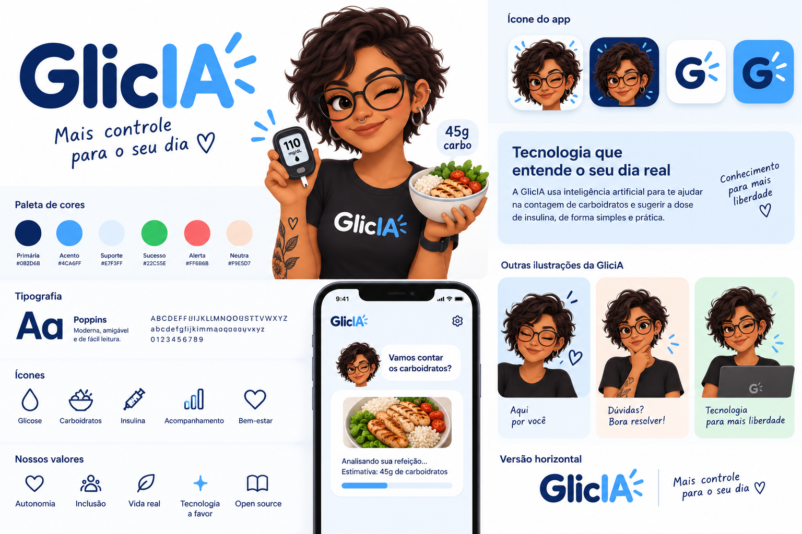

# Identidade visual e voz da Glicia

Referência fornecida em 2026-09-06. Esta é a direção aprovada pela pessoa autora para a
repaginação; as aplicações descritas aqui são especificações para implementação futura.
A primeira implementação da identidade entrou na PWA em 2026-09-06: tokens azulados, Poppins
local, wordmark, avatar, ícones de instalação, chat e onboarding conversacional. As variantes
adicionais da avatar e uma logo vetorial fiel permanecem futuras.

## Ideia central

A Glicia é uma assistente virtual que conversa com a proximidade de uma amiga e ajuda a
organizar a contagem de carboidratos. A avatar dá rosto a essa conversa. A experiência deve
ser adulta, acolhedora, direta e sem julgamento sobre alimentos ou hábitos.

A assinatura visual é a combinação da avatar com o azul-marinho, o azul claro e a marca
GlicIA. O chat é o centro do produto. A prancha é uma referência de identidade, não um layout
de dashboard para reproduzir nem uma promessa de reconhecimento de refeições por fotografia.

Usar **Glicia** no texto, na navegação e no nome acessível. Preservar a grafia **GlicIA** na
arte da marca, com `IA` em azul-acento. A frase “Mais controle para o seu dia” pertence ao
repertório de marca; não substitui automaticamente o subtítulo já solicitado,
“Glicia: sua assistente de contagem de carboidratos”. Esse subtítulo pode acompanhar a
apresentação inicial, sem se repetir em cada mensagem ou ocupar o cabeçalho inteiro do chat.

## Paleta

Os valores abaixo transcrevem os códigos escritos na prancha, sem amostrar sombras da imagem.

| Papel | Cor | Aplicação |
| --- | --- | --- |
| Primária | `#0B2D6B` | Texto principal, marca, ação principal e ícones |
| Acento | `#4CA6FF` | Destaques, detalhes da marca e estados selecionados |
| Suporte | `#E7F3FF` | Fundo suave e diferenciação de mensagens |
| Sucesso | `#22C55E` | Confirmação de uma operação, acompanhada de texto |
| Alerta | `#FF6B6B` | Sinalização pontual de atenção/erro, acompanhada de texto |
| Neutra | `#F9E5D7` | Apoio em ilustrações e boas-vindas |
| Superfície | `#FFFFFF` | Mensagens, campos e áreas de leitura |

Criar tokens semânticos na implementação, por exemplo `text-primary`, `surface-chat`,
`surface-message`, `action-primary`, `border-input`, `text-error` e `focus-ring`. Tons derivados
para bordas e texto de erro são permitidos, desde que documentados e verificados em contraste.
Não usar uma cor da paleta indiscriminadamente para texto, fundo e borda.

Meta de implementação: contraste de texto comum de pelo menos 4,5:1, texto grande de 3:1
e controles/foco distinguíveis com 3:1. Azul-acento, verde e coral não ficam automaticamente
aptos para texto sobre branco. Preferir ação azul-marinho com texto branco; testar foco em
cada superfície. Não codificar glicemias, alimentos ou estados somente por cor.

## Tipografia e composição

- Poppins, conforme a referência, também nas mensagens: pesos 400 para leitura, 500/600 para
  controles e 600/700 para títulos. A PWA usa `@fontsource/poppins` com subconjunto latino
  embutido; consultar a licença OFL distribuída pelo pacote antes de redistribuição.
- Base proposta de 16 px para texto e campos, entrelinha próxima de 1,5 e números com unidades
  visíveis. Tipografia manuscrita somente em assets de marca, nunca na informação funcional.
- Espaçamento baseado em 4/8 px; cantos de 12–20 px como ponto de partida. Evitar cartões
  aninhados, sombras em toda mensagem, etiquetas em caixa alta e títulos gigantes no chat.
- Celular: cabeçalho compacto, conversa e compositor alcançável com o teclado aberto.
  Desktop: a mesma conversa em coluna central de leitura confortável, sem painéis vazios.
- Animações breves para feedback real; não simular atraso, digitação ou progresso percentual
  fictício. Respeitar redução de movimento e evitar piscar/animar a avatar continuamente.

Esses valores de composição são propostas para o primeiro protótipo code-first, não medidas
extraídas da tela ilustrada na prancha.

## Avatar e assets

Preservar os traços da personagem: pele castanha, cabelo curto escuro ondulado, óculos
redondos, acessórios e camiseta escura. A mesma personagem deve aparecer no onboarding,
mensagens e ajuda. Não redesenhar o rosto a cada estado.

Aplicação proposta: rosto pequeno no cabeçalho e no início de grupos de mensagens; busto maior
nas boas-vindas. Usar expressão acolhedora na entrada, atenta na ajuda e neutra em erros ou
bloqueios. Evitar personagem piscando ou festejando junto a uma sugestão de insulina.
Não expor “online” ou “monitorando” se isso sugerir acompanhamento que não existe.

A prancha e uma avatar acolhedora isolada estão disponíveis. Os próximos assets devem ser
preparados e verificados antes de ampliação visual:

| Asset a preparar | Destino/uso proposto |
| --- | --- |
| Logotipo horizontal transparente | Cabeçalho e login; vetor fiel quando disponível |
| Avatar acolhedora em fundo neutro | Boas-vindas e início da conversa |
| Avatar atenta/neutra | Ajuda e estados que exigem atenção |
| Ícone com avatar e fundo claro | Candidato para instalação; verificar legibilidade em tamanho pequeno |
| Símbolo G com raios da referência | Favicon e alternativa de ícone em tamanhos reduzidos |
| Poppins e respectiva licença | Fonte local da PWA |

Assets finais devem entrar em `apps/pwa/public/brand/`; ícones de instalação devem seguir os
caminhos efetivos do manifest e a configuração atual de URLs. Produzir variantes de tamanhos e
maskable conforme necessário. Registrar origem e conferir direitos/licenças antes de redistribuir.
Não apresentar a prancha ou um recorte de baixa resolução como logo final transparente. A primeira
avatar isolada implementada usa um fundo neutro quadrado para preservar bordas e contraste.

Avatar junto do nome “Glicia” pode ter `alt=""` para evitar repetição. Ícones de ação precisam
de nome acessível. A mensagem deve continuar legível se uma imagem não carregar.

## Voz e exemplos

Usar “eu” para a assistente e “você” para a pessoa, sem apelidos forçados. A linguagem de amiga
significa escuta, clareza e liberdade para corrigir; não significa simular uma pessoa humana.
Explicar no primeiro contato que a Glicia é uma assistente virtual.

| Momento | Texto proposto |
| --- | --- |
| Boas-vindas | “Oi, eu sou a Glicia. Vou te ajudar a contar os carboidratos das suas refeições.” |
| Início da refeição | “Me conta o que você vai comer. Pode incluir a glicemia, a seta e qual é a refeição.” |
| Porção ambígua | “Essa porção de arroz equivale a quantas colheres?” |
| Revisão | “Confere se entendi sua refeição?” |
| Correção | “Certo, vou atualizar a porção. Depois você confere de novo.” |
| Explicação | “Eu consulto exclusivamente a tabela da Sociedade Brasileira de Diabetes, organizo os alimentos e encontro os carboidratos. Você confere antes de continuar.” |
| Falha de envio | “Não consegui enviar sua mensagem. Ela continua aqui para você tentar de novo.” |
| Retomada | “Vamos continuar de onde você parou?” |

Os textos de falha só podem afirmar preservação do rascunho depois que esse comportamento
estiver implementado. Evitar frases como “refeição ruim”, “dose ideal”, “pode aplicar”,
“confie em mim” ou comemorações por decisões clínicas. Usar avisos necessários no momento
da decisão, com acesso a explicações, em vez de repetir um aviso longo em todos os balões.

## Uso da skill

A skill versionada está em [docs/skills/glicia-identidade/SKILL.md](skills/glicia-identidade/SKILL.md).
Ela pode ser lida diretamente pelo agente com a instrução “Leia
`docs/skills/glicia-identidade/SKILL.md` e aplique a identidade da Glicia”.
Uma instalação no diretório de skills do agente permite invocá-la como `$glicia-identidade`;
somente criar os arquivos em `docs/` não implica descoberta automática na sessão atual.
Neste ambiente, foi registrado um link no diretório de skills do Codex para a fonte versionada.
Uma nova sessão poderá descobrir a skill; se o repositório mudar de lugar, atualizar o link.

Consulte o [plano](plano-experiencia-conversacional.md) para sequência, escopo e critérios de aceite.
